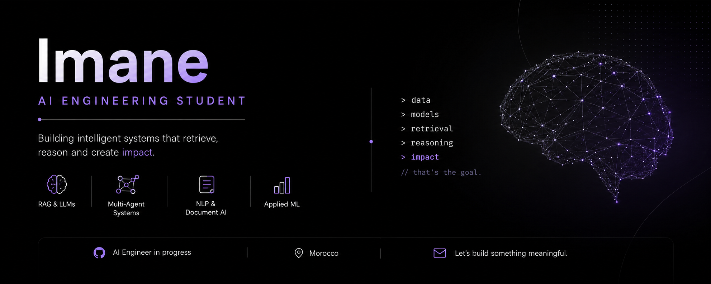

  

<h3 align="center">
  AI Engineering Student · RAG · LLMs · Multi-Agent Systems · Applied ML
</h3>

  
  

---

## About

AI Engineering student at **ENIAD Berkane — Université Mohammed Premier**, focused on building practical AI systems beyond the notebook.

I enjoy turning real-world, unstructured data into intelligent applications through **RAG pipelines, LLMs, multi-agent systems, NLP, document processing, and applied machine learning**.

My projects cover legal intelligence, medical document processing, clinical workflows, financial due diligence, and interactive AI/ML education.

🎯 **Currently seeking a final-year PFE internship in AI/ML, RAG, LLMs, or intelligent systems in Morocco or abroad.**

---

## Tech Stack

**AI / LLMs**  
PyTorch · RAG · LLMs · LangGraph · NLP · Computer Vision

**Multi-Agent Systems**  
JADE · MCP · A2A · LangGraph

**Machine Learning**  
DQN · PPO · GRPO · Classical ML

**Data & Retrieval**  
FAISS · BM25 · Multilingual Embeddings · PyMuPDF · Tesseract OCR

**Backend & Infrastructure**  
Flask · FastAPI · REST APIs · Docker

**Frontend**  
React · TypeScript · Streamlit

---

## Featured Projects

### 🏛️ [Mizan — AI Legal Assistant for Moroccan SMEs](YOUR_MIZAN_REPO_URL)

Bilingual AI legal assistant designed to help Moroccan SMEs interact with legal and judicial information.

- Automated scraping and processing pipeline for **4,176 Moroccan judicial decisions + 50 laws**
- OCR + PyMuPDF document extraction
- Hybrid retrieval combining **BM25 + FAISS**
- Multilingual embeddings using `multilingual-e5-small`
- Llama 3.3 70B for answer generation
- Source-grounded responses designed to reduce hallucinations
- Full-stack architecture with React, Flask, and Docker

`RAG` `BM25` `FAISS` `Llama 3.3` `Flask` `React` `PyMuPDF` `OCR` `Docker`

📊 **4,226-document corpus · 92% hallucination-evaluation score · 100% source fidelity**

---

### 🏥 [MedSanad — AI Microservices Platform for Medical Practices](YOUR_MEDSANAD_REPO_URL)

AI-powered microservices platform designed to assist medical practices with medical document processing, patient information, and intelligent assistance.

My contributions include:

- 📄 **Medical report (bilans) extraction module**
- 🔎 **Patient-dossier RAG module**
- 🤖 **AI assistant interface**
- 🔐 **Authentication and login interface**
- Medical document processing using PyMuPDF and Tesseract OCR
- Retrieval using FAISS/BM25
- LLM integration through Groq
- Frontend integration with backend microservices
- Dockerized service architecture

`FastAPI` `PyMuPDF` `Tesseract` `FAISS` `BM25` `Groq` `React` `Docker`

---

### ⚕️ [SysOrient-Clinique — Multi-Agent Clinical Orientation](YOUR_SYSORIENT_REPO_URL)

Multi-agent clinical orientation workflow developed as a **Multi-Agent Systems course project**.

The system guides patients through a structured clinical journey using specialized AI agents, with human-in-the-loop interactions.

`LangGraph` `FastAPI` `Streamlit` `Ollama` `MCP` `Docker`

---

### 🕹️ [DRL Interactive Explorer](YOUR_DRL_REPO_URL)

Interactive educational website designed to make **Deep Reinforcement Learning** concepts easier to understand.

Covers agents, environments, rewards, policies, and reinforcement learning algorithms through interactive explanations and visualizations.

`Python` `JavaScript` `HTML`

---

### 🤝 [InsightDeal — Multi-Agent Due Diligence](YOUR_INSIGHTDEAL_REPO_URL)

Multi-agent platform designed to assist with **financial and business due diligence for Moroccan SMEs**.

Adapted from a hackathon project for an internship challenge, using specialized AI agents to analyze and synthesize business information.

`LangGraph` `Multi-Agent Systems` `LLMs`

---

## 🏆 Hackathons

### 🧠 [Sovereign Mind — CDG Capital MIATHON 2025](YOUR_SOVEREIGN_MIND_REPO_URL)

Multi-agent financial intelligence platform developed by a team of 5 to address two financial intelligence challenges.

The platform combines AI agents, real-time information retrieval, financial analysis, interactive visualization, and automated reporting.

`LangGraph` `Groq Llama 3.3 70B` `Tavily` `FastAPI` `SSE` `React` `D3.js` `ReportLab`

---

## Other Projects

| Project | Description | Stack |
|---|---|---|
| ❤️ [**Heart Disease Classifier**](YOUR_HEART_REPO_URL) | SVM model achieving 85.2% accuracy and F1-score of 0.846, served through a Flask API | `scikit-learn` `Flask` |
| 📝 [**Smart Notes AI**](YOUR_SMART_NOTES_REPO_URL) | RAG-powered study assistant for interacting with personal study documents | `Streamlit` `FAISS` `Groq` `PyMuPDF` |

---

## 🎓 Education

| Degree | Institution |
|---|---|
| **Engineering Cycle — AI** | ENIAD Berkane · Université Mohammed Premier |
| **DUT — Web & Mobile Development** | EST Nador |

---

## 🔭 Currently Exploring

- 🔎 Advanced RAG & retrieval pipelines
- 🤖 Multi-Agent architectures
- 📄 Document AI & multilingual OCR
- 🧠 LLM-based intelligent systems
- ⚙️ Production-ready AI microservices

---

## 🤝 Let's Connect

  <b>Open to PFE opportunities in AI/ML, RAG, LLMs & Multi-Agent Systems.</b>

  <a href="https://www.linkedin.com/in/imaneberrada-ai">LinkedIn</a>
  ·
  <a href="mailto:berrada.imane.ia@gmail.com">berrada.imane.ia@gmail.com</a>

  <i>Building intelligent systems that retrieve, reason and create impact.</i>

